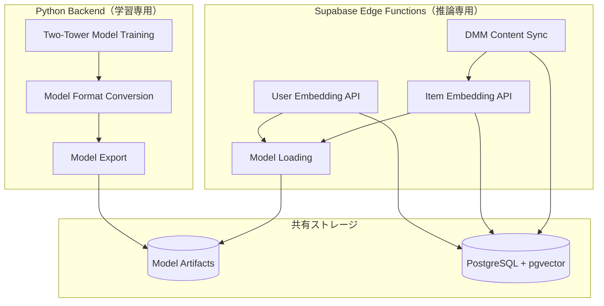

# バックエンドフォルダ組織化 - 設計仕様書（学習済みモデル実行版）

## 概要

Adult Matching Applicationにおいて、**Python Backend**で学習されたTwo-Towerモデルを**Supabase Edge Functions**で実行する設計です。学習とデプロイメントの責任分離を明確にし、リアルタイムエンベディング生成を最適化します。

## アーキテクチャ戦略

### 🔄 **学習 vs 推論の責任分離**



## モデル実行環境設計

### 🔧 **Supabase Edge Functions でのモデル実行**

#### TensorFlow.js 対応戦略
```typescript
// /supabase/functions/_shared/model_loader.ts
import * as tf from 'https://cdn.skypack.dev/@tensorflow/tfjs@latest';

export class TwoTowerModelLoader {
  private userTower: tf.LayersModel | null = null;
  private itemTower: tf.LayersModel | null = null;
  
  async loadModels(): Promise<void> {
    // Supabase Storage からモデル読み込み
    this.userTower = await tf.loadLayersModel('https://[supabase-storage]/user_tower.json');
    this.itemTower = await tf.loadLayersModel('https://[supabase-storage]/item_tower.json');
  }
  
  async generateUserEmbedding(features: UserFeatures): Promise<number[]> {
    const inputTensor = tf.tensor2d([this.preprocessUserFeatures(features)]);
    const embedding = await this.userTower!.predict(inputTensor) as tf.Tensor;
    return await embedding.data() as Float32Array;
  }
  
  async generateItemEmbedding(features: ItemFeatures): Promise<number[]> {
    const inputTensor = tf.tensor2d([this.preprocessItemFeatures(features)]);
    const embedding = await this.itemTower!.predict(inputTensor) as tf.Tensor;
    return await embedding.data() as Float32Array;
  }
}
```

### 🏗️ **フォルダ構造設計**

#### Python Backend（学習・変換）
```
/backend/
├── ml_pipeline/
│   ├── training/
│   │   ├── two_tower_trainer.py       # 【既存】Two-Towerモデル学習
│   │   └── train_768_dim_two_tower.py # 【既存】768次元モデル学習
│   ├── export/                        # 【新規】モデル変換・エクスポート
│   │   ├── keras_to_tfjs.py          # Keras → TensorFlow.js 変換
│   │   ├── model_validator.py        # 変換後モデル検証
│   │   └── supabase_uploader.py      # Supabase Storage アップロード
│   └── models/                        # 【既存】学習済みモデル
│       ├── rating_based_two_tower_768/
│       │   ├── user_tower_768.keras
│       │   ├── item_tower_768.keras
│       │   └── full_model_768.keras
│       └── tfjs_exports/              # 【新規】TensorFlow.js用モデル
│           ├── user_tower.json
│           ├── user_tower.bin
│           ├── item_tower.json
│           └── item_tower.bin
├── data_processing/                   # 【統合】データ処理
│   ├── dmm_integration/              # 【既存】DMM API統合
│   └── feature_extraction/           # 【既存】特徴量抽出
└── scripts/                          # 【統合】
    ├── model_deployment.py           # 【新規】モデル自動デプロイメント
    └── dmm_batch_sync.py             # 【既存】DMM一括同期
```

#### Supabase Edge Functions（推論・API）
```
/supabase/
├── functions/
│   ├── _shared/
│   │   ├── model_loader.ts           # 【新規】TensorFlow.jsモデルローダー
│   │   ├── feature_preprocessor.ts   # 【新規】特徴量前処理
│   │   └── types.ts                  # 【既存】型定義
│   ├── user_embedding_v2/            # 【新規】学習済みモデル版
│   │   └── index.ts                  # Two-Towerユーザーエンベディング
│   ├── item_embedding/               # 【新規】アイテムエンベディング
│   │   └── index.ts                  # コンテンツエンベディング生成
│   ├── dmm_content_sync/             # 【拡張】
│   │   └── index.ts                  # DMM取得 + エンベディング生成
│   └── update_user_embedding/        # 【既存維持】簡易版フォールバック
│       └── index.ts                  
└── storage/                          # 【新規】モデルストレージ設定
    └── models/                       # TensorFlow.jsモデル格納
```

## コンポーネント設計

### Python Backend（学習・変換専用）

#### Model Export Pipeline
```python
# /backend/ml_pipeline/export/keras_to_tfjs.py
class KerasToTensorFlowJSConverter:
    def __init__(self, model_path: str, output_path: str):
        self.model_path = model_path
        self.output_path = output_path
    
    def convert_user_tower(self) -> None:
        """ユーザータワーをTensorFlow.js形式に変換"""
        model = tf.keras.models.load_model(f"{self.model_path}/user_tower_768.keras")
        
        # TensorFlow.js形式でエクスポート
        tfjs.converters.save_keras_model(
            model, 
            f"{self.output_path}/user_tower"
        )
        
    def convert_item_tower(self) -> None:
        """アイテムタワーをTensorFlow.js形式に変換"""
        model = tf.keras.models.load_model(f"{self.model_path}/item_tower_768.keras")
        
        tfjs.converters.save_keras_model(
            model,
            f"{self.output_path}/item_tower"
        )
        
    def validate_conversion(self) -> ValidationResult:
        """変換されたモデルの精度検証"""
        # Keras vs TensorFlow.js 推論結果比較
        pass
```

#### Supabase Model Deployment
```python
# /backend/scripts/model_deployment.py
class SupabaseModelDeployment:
    def __init__(self, supabase_client: Client):
        self.client = supabase_client
    
    def upload_tfjs_models(self, model_dir: str) -> None:
        """TensorFlow.jsモデルをSupabase Storageにアップロード"""
        files = ['user_tower.json', 'user_tower.bin', 'item_tower.json', 'item_tower.bin']
        
        for file in files:
            self.client.storage.from_('models').upload(
                file, 
                open(f"{model_dir}/{file}", 'rb')
            )
    
    def trigger_model_reload(self) -> None:
        """Edge FunctionsのモデルReload トリガー"""
        self.client.functions.invoke('reload_models')
```

### Supabase Edge Functions（推論専用）

#### 学習済みモデルによるエンベディング生成
```typescript
// /supabase/functions/user_embedding_v2/index.ts
import { TwoTowerModelLoader } from '../_shared/model_loader.ts';
import { FeaturePreprocessor } from '../_shared/feature_preprocessor.ts';

const modelLoader = new TwoTowerModelLoader();
const preprocessor = new FeaturePreprocessor();

serve(async (req: Request) => {
  try {
    // モデルロード（初回のみ）
    if (!modelLoader.isLoaded()) {
      await modelLoader.loadModels();
    }
    
    const { user_id } = await req.json();
    
    // ユーザー特徴量取得
    const userFeatures = await getUserFeatures(user_id);
    
    // 学習済みTwo-Towerモデルで推論
    const embedding = await modelLoader.generateUserEmbedding(userFeatures);
    
    // PostgreSQL + pgvector に保存
    await supabaseClient
      .from('user_embeddings')
      .upsert({
        user_id: user_id,
        embedding: Array.from(embedding),
        model_version: 'two_tower_v2',
        updated_at: new Date().toISOString()
      });
      
    return new Response(JSON.stringify({ 
      success: true, 
      embedding_dim: embedding.length,
      model_version: 'two_tower_v2'
    }));
    
  } catch (error) {
    // フォールバック: 簡易線形モデル
    return await fallbackToSimpleModel(req);
  }
});
```

#### DMM Content Sync + Embedding
```typescript
// /supabase/functions/dmm_content_sync/index.ts
serve(async (req: Request) => {
  try {
    // DMM APIからコンテンツ取得
    const dmmContent = await fetchDMMContent();
    
    // 各コンテンツのアイテムエンベディング生成
    for (const item of dmmContent) {
      const itemFeatures = extractItemFeatures(item);
      const embedding = await modelLoader.generateItemEmbedding(itemFeatures);
      
      // videos + video_embeddings テーブル更新
      await Promise.all([
        supabaseClient.from('videos').upsert(item),
        supabaseClient.from('video_embeddings').upsert({
          video_id: item.id,
          embedding: Array.from(embedding),
          model_version: 'two_tower_v2'
        })
      ]);
    }
    
    return new Response(JSON.stringify({
      success: true,
      processed_items: dmmContent.length,
      model_version: 'two_tower_v2'
    }));
  } catch (error) {
    console.error('DMM sync failed:', error);
    return new Response(JSON.stringify({ error: error.message }), { status: 500 });
  }
});
```

## データフロー設計

### 1. モデル学習 → デプロイメントフロー
```
Python Backend:
1. Two-Towerモデル学習 (existing)
2. Keras → TensorFlow.js 変換
3. Supabase Storage アップロード
4. Edge Functions モデルリロードトリガー

Supabase Edge Functions:
5. TensorFlow.jsモデル読み込み
6. リアルタイムエンベディング生成開始
```

### 2. ユーザーエンベディング更新フロー
```
User Action (like/view) → 
Supabase Edge Functions (user_embedding_v2) →
TensorFlow.js Two-Tower推論 →
PostgreSQL + pgvector 更新
```

### 3. コンテンツ統合フロー
```
Cron/Manual Trigger → 
Supabase Edge Functions (dmm_content_sync) →
DMM API データ取得 →
TensorFlow.js Item Tower推論 →
videos + video_embeddings テーブル更新
```

## 技術要件

### TensorFlow.js 統合要件
- **モデル形式**: Keras (.keras) → TensorFlow.js (.json + .bin)
- **実行環境**: Deno Edge Runtime での TensorFlow.js サポート
- **メモリ管理**: モデル読み込み後のメモリ効率化
- **エラーハンドリング**: TensorFlow.js実行失敗時の簡易モデルフォールバック

### Supabase Storage統合
- **モデル格納**: TensorFlow.jsモデルファイルのStorage配置
- **バージョン管理**: モデル更新時の無停止デプロイメント
- **CDN配信**: 高速モデルダウンロードのためのCDN活用

### DMM統合強化
- **大量処理**: 数万件のコンテンツ同時処理
- **レート制限**: DMM API制限下での効率的データ取得
- **エンベディング並列化**: 複数アイテムの並列エンベディング生成

## エラーハンドリング・フォールバック

### モデル実行エラー
1. **TensorFlow.js読み込み失敗** → 簡易線形モデルフォールバック
2. **推論メモリエラー** → バッチサイズ削減・再実行
3. **モデルファイル破損** → 前バージョンモデル自動復旧

### DMM統合エラー
1. **API制限超過** → 指数バックオフ・再試行
2. **大量データ処理タイムアウト** → チャンク分割・段階実行
3. **エンベディング生成失敗** → 個別アイテム再処理キュー

## パフォーマンス最適化

### TensorFlow.js最適化
- **モデルキャッシュ**: Edge Functions間でのモデル共有
- **WebAssembly**: 高速数値計算のためのWASM活用
- **並列処理**: 複数ユーザーの同時エンベディング生成

### Supabase最適化
- **Connection Pooling**: データベース接続最適化
- **pgvector調整**: 768次元ベクトル検索の高速化
- **Edge Functions Cold Start**: 初期化時間最小化

## 実装フェーズ

### Phase 1: モデル変換基盤（3時間）
- Python Backend でのKeras → TensorFlow.js変換機能
- Supabase Storage統合・アップロード機能
- 変換モデル精度検証

### Phase 2: Supabaseモデル実行（3時間）
- TensorFlow.js モデルローダー実装
- 学習済みTwo-Tower推論エンジン
- ユーザー・アイテムエンベディング生成API

### Phase 3: DMM統合強化（2時間）
- 大量コンテンツ処理機能
- エンベディング並列生成
- エラーハンドリング・再試行機能

### Phase 4: フォルダ統合（1時間）
- `/backend/edge_functions/` → `/backend/shared/` 統合
- 重複フォルダ削除・整理

### Phase 5: 総合テスト（2時間）
- エンドツーエンドテスト
- パフォーマンス・精度検証
- 本番デプロイメント確認