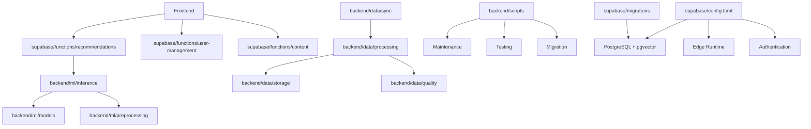

# Design Document

## Overview

バックエンドリファクタリングは、現在の分散した機能と重複コードを統合し、保守性とスケーラビリティを向上させる包括的な再構築プロジェクトです。このリファクタリングは、Edge Functions の統合、MLパイプラインの最適化、データ処理の合理化、およびディレクトリ構造の論理的再編成を含みます。

リファクタリング後のシステムは、明確な責任分離、一貫したアーキテクチャパターン、および改善された開発者体験を提供します。

## Steering Document Alignment

### Technical Standards (tech.md)
- **TypeScript/JavaScript**: 既存のTypeScript実装パターンを維持
- **Supabase Edge Functions**: Deno ランタイムとベストプラクティスに準拠
- **Python ML Pipeline**: uv パッケージマネージャーと pyproject.toml 構成を継続使用
- **PostgreSQL**: RLS ポリシーとベクター検索の最適化パターンを維持

### Project Structure (structure.md)
- **Frontend**: 既存の Next.js App Router 構造は変更なし
- **Backend**: 機能別グループ化による論理的構造の確立
- **ML Pipeline**: training/preprocessing/inference/deployment の明確な分離
- **Scripts**: ユーティリティとメンテナンススクリプトの整理

## Supabase Configuration Management

### Current Supabase Structure (維持)
```
supabase/
├── config.toml              # メイン設定ファイル（保持・強化）
├── migrations/               # データベースマイグレーション（保持）
├── seed.sql                 # 初期データシード（保持）
├── functions/               # Edge Functions（リファクタリング対象）
└── .gitignore               # Supabase固有除外設定（保持）
```

### Configuration Files Strategy

#### 1. config.toml - 設定ファイルの取り扱い
**保持する設定:**
- **Database Configuration**: PostgreSQL 17設定、pgvector拡張
- **Authentication Settings**: JWT設定、RLS有効化
- **Edge Runtime Secrets**: DMM API認証情報（暗号化管理）
- **API Configuration**: ポート設定、レート制限
- **Storage Settings**: ファイルサイズ制限、バケット設定

**強化する設定:**
- **Environment-specific Config**: 開発/ステージング/本番環境の分離
- **Security Hardening**: より厳格なレート制限とCORS設定
- **Performance Optimization**: 接続プール設定の最適化
- **Monitoring Integration**: ログ・メトリクス設定の強化

#### 2. Migrations管理の強化
**現在のマイグレーション（保持）:**
- `20250818000000000_initial.sql` - 基本スキーマ
- `20250824151637_refactor_user_decisions.sql` - ユーザー決定システム
- `20250827151000_expand_get_videos_feed_include_no_sample.sql` - 動画フィード拡張

**リファクタリング用新規マイグレーション:**
- Edge Functions統合に伴うRLS更新
- パフォーマンス最適化インデックス
- ベクター検索の高速化設定

#### 3. Environment Variables セキュリティ強化
**Secrets Management:**
```toml
[edge_runtime.secrets]
DMM_API_ID = "env(DMM_API_ID)"           # 環境変数から読み込み
DMM_AFFILIATE_ID = "env(DMM_AFFILIATE_ID)" # 環境変数から読み込み
OPENAI_API_KEY = "env(OPENAI_API_KEY)"   # 既存設定の強化
```

**Development vs Production:**
- 開発環境: ローカル設定ファイル
- 本番環境: 環境変数とシークレット管理
- CI/CD: 暗号化されたシークレット管理

## Folder Structure Reorganization

### Current Structure Issues
- **scripts/** - 重複機能と混在するスクリプト群（Python/JS/TS）
- **data_processing/** - 分散したデータ処理ロジック
- **supabase/functions/** - 重複する推薦関数群
- **ml_pipeline/** - 混在する64次元/768次元モデル

### Target Folder Structure

```
├── supabase/                     # Supabase設定・マイグレーション（維持・強化）
│   ├── config.toml              # 環境別設定管理
│   ├── migrations/              # データベーススキーマ管理
│   ├── seed.sql                 # 初期データ・テストデータ
│   └── functions/               # リファクタリング後のEdge Functions
│       ├── recommendations/     # 統合推薦システム
│       ├── user-management/     # ユーザー関連API
│       ├── content/             # コンテンツ関連API
│       └── _shared/             # 共有ユーティリティ
├── backend/                      # 新規: バックエンドロジック集約
│   ├── ml/                      # ML Pipeline (統合・再編成)
│   │   ├── models/              # モデルアーティファクト
│   │   │   └── two_tower_768/   # 768次元実装（標準）
│   │   ├── training/            # トレーニングシステム
│   │   ├── preprocessing/       # 特徴量処理
│   │   ├── inference/           # 推論エンジン
│   │   └── evaluation/          # モデル評価・監視
│   ├── data/                    # データ処理システム
│   │   ├── sync/                # 外部API同期
│   │   │   ├── dmm/             # DMM API統合
│   │   │   └── monitoring/
│   │   ├── processing/          # データ変換・クリーニング
│   │   ├── storage/             # データストレージ管理
│   │   └── quality/             # データ品質管理
│   ├── scripts/                 # 統合スクリプト
│   │   ├── maintenance/         # メンテナンス用
│   │   ├── migration/           # データ移行
│   │   ├── testing/             # テスト関連
│   │   └── deployment/          # デプロイメント
│   └── tests/                   # 統合テストスイート
│       ├── unit/
│       ├── integration/
│       └── e2e/
├── frontend/                     # フロントエンド（変更なし）
└── docs/                         # ドキュメント（変更なし）
```

### Supabase Functions Refactoring Strategy

#### Current Edge Functions (統合・最適化)
```
supabase/functions/ (11 functions → 6 functions)
├── enhanced_two_tower_recommendations/  # メイン推薦（保持・強化）
├── recommendations/                     # 削除（重複機能）
├── two_tower_recommendations/           # 削除（旧実装）
├── likes/                              # user-management/ に移動
├── update_user_embedding/               # user-management/ に移動
├── delete_account/                      # user-management/ に移動
├── feed_explore/                        # content/ に移動
├── videos-feed/                         # content/ に統合
├── dmm_sync/                           # backend/data/sync/ に移動
├── update_embeddings/                   # backend/ml/preprocessing/ に移動
└── _shared/                            # 共有ライブラリ（強化）
```

#### Target Edge Functions Structure
```
supabase/functions/
├── recommendations/
│   └── enhanced_two_tower/             # 統合推薦API
├── user-management/
│   ├── likes/                          # いいね管理
│   ├── embeddings/                     # ユーザー埋め込み更新
│   └── account/                        # アカウント管理
├── content/
│   └── feed/                           # 統合フィード
└── _shared/
    ├── database/                       # DB接続・クエリ
    ├── auth/                           # 認証ヘルパー
    ├── validation/                     # 入力検証
    └── monitoring/                     # ログ・メトリクス
```

### Migration Plan by Component

#### 1. Supabase Configuration Enhancement
**Phase 1: Environment Separation**
- 開発用: `config.local.toml`
- 本番用: `config.production.toml`
- 共通設定: `config.toml` (ベース設定)

**Phase 2: Security Hardening**
- API Key暗号化管理の強化
- レート制限の環境別調整
- CORS設定の最適化

**Phase 3: Performance Optimization**
- pgvector設定の最適化
- 接続プール設定の調整
- キャッシュ戦略の実装

#### 2. Edge Functions Consolidation
**Current:** `supabase/functions/` (11 functions)
**Target:** `supabase/functions/` (6 consolidated functions)

- **Keep & Enhance:** `enhanced_two_tower_recommendations`
- **Consolidate:** `recommendations` + `two_tower_recommendations` → **削除**
- **Reorganize:** `likes`, `update_user_embedding`, `delete_account` → `user-management/`
- **Migrate:** `dmm_sync`, `update_embeddings` → `backend/` 配下

#### 3. ML Pipeline Restructure
**Current:** `ml_pipeline/` (混在構造)
**Target:** `backend/ml/` (明確な責任分離)

- **Models:** 768次元実装を標準化、64次元アーティファクトをアーカイブ
- **Training:** 重複トレーニングスクリプトの統合
- **Preprocessing:** 特徴量処理の統一インターフェース
- **Inference:** リアルタイム/バッチ推論の分離

#### 4. Data Processing Integration
**Current:** `data_processing/` + 分散スクリプト
**Target:** `backend/data/` (統合データ管理)

- **Sync:** DMM API同期ロジックの統合
- **Processing:** レビュー・ユーザー・コンテンツ処理の分離
- **Storage:** 構造化されたデータストレージ管理
- **Quality:** データ品質監視の集約

#### 5. Scripts Reorganization
**Current:** `scripts/` (50+ 混在ファイル)
**Target:** `backend/scripts/` (機能別整理)

**Migration Mapping:**
```
# Training Scripts → backend/ml/training/scripts/
train_*.py → backend/ml/training/scripts/
test_*_model.py → backend/tests/unit/ml/

# DMM Sync Scripts → backend/data/sync/dmm/
*_dmm_sync.js → backend/data/sync/dmm/
analyze_dmm_data.js → backend/data/quality/

# Testing Scripts → backend/scripts/testing/
test_*.py → backend/scripts/testing/
verify_*.py → backend/scripts/testing/

# Maintenance → backend/scripts/maintenance/
analyze_*.js → backend/scripts/maintenance/
quick_db_check.js → backend/scripts/maintenance/
```

### Directory Structure Benefits

#### 1. Clear Separation of Concerns
- **Supabase Layer**: 設定、マイグレーション、Edge Functions
- **Backend Layer**: ML、データ処理、運用スクリプト
- **Frontend Layer**: UI・UX（既存維持）
- **Documentation Layer**: 仕様・ガイド（既存維持）

#### 2. Improved Configuration Management
- **Environment-specific Settings**: 環境別設定の明確な分離
- **Security Enhancement**: 認証情報の安全な管理
- **Deployment Automation**: 設定ファイルを利用した自動デプロイ
- **Rollback Capability**: 設定変更の履歴管理とロールバック

#### 3. Enhanced Developer Experience
- **Predictable File Locations**: 機能別の論理的配置
- **Reduced Cognitive Load**: 重複ファイルの削除
- **Better Documentation**: 各ディレクトリのREADME配置
- **Easier Onboarding**: 新規開発者の学習コスト削減

#### 4. Operational Excellence
- **Version Control**: 関連ファイルのグループ化
- **Testing Strategy**: テスト構造の明確化
- **Deployment**: 機能別デプロイメントの容易化
- **Monitoring**: 構造化されたログとメトリクス

## Code Reuse Analysis

### Existing Components to Leverage
- **enhanced_two_tower_recommendations**: 最新の推薦システム実装として維持・強化
- **real_dmm_sync.js**: 実証済みのDMM API統合スクリプトをベースライン実装として採用
- **rating_based_two_tower_trainer**: 768次元実装を標準トレーニングシステムとして継続使用
- **enhanced_item_feature_processor**: 現在の特徴量処理パイプラインを拡張
- **Supabase config.toml**: 既存の設定を基盤として環境別管理を実装

### Integration Points
- **Supabase Database**: 既存のRLSポリシーとスキーマ構造を維持
- **Vector Embeddings**: pgvector 768次元実装をベースに統合
- **Authentication System**: Supabase Auth との統合ポイントは変更なし
- **Frontend API**: 既存のフロントエンド契約を破らない後方互換性確保
- **Configuration Management**: 既存のconfig.tomlを拡張し環境別設定を実装

## Architecture

リファクタリングされたバックエンドは、以下の原則に基づいて設計されます：

### Modular Design Principles
- **Single File Responsibility**: 各ファイルは明確に定義された単一の機能を担当
- **Component Isolation**: 機能ごとの小さな、焦点を絞ったコンポーネント
- **Service Layer Separation**: データアクセス、ビジネスロジック、プレゼンテーション層の分離
- **Utility Modularity**: 特定目的に特化したユーティリティモジュール
- **Configuration Layering**: 環境別設定の階層化管理



## Components and Interfaces

### Enhanced Recommendation System
- **Purpose:** 統一された推薦API提供
- **Location:** `supabase/functions/recommendations/enhanced_two_tower/`
- **Configuration:** `supabase/config.toml` の edge_runtime設定を利用
- **Interfaces:** 
  - `POST /enhanced_two_tower_recommendations` - メイン推薦エンドポイント
  - Real-time embedding generation for new users
- **Dependencies:** ML Pipeline, PostgreSQL, Vector Search
- **Reuses:** 既存の768次元Two-Towerモデルと特徴量処理

### ML Pipeline Orchestrator
- **Purpose:** トレーニングから推論までの統一されたワークフロー管理
- **Location:** `backend/ml/`
- **Configuration:** `pyproject.toml` でのPython依存関係管理
- **Interfaces:**
  - Training API for model updates
  - Batch processing for embedding updates
  - Model versioning and deployment
- **Dependencies:** PostgreSQL, Model Storage, Feature Processors
- **Reuses:** 既存のrating_based_two_tower_trainer、enhanced_item_feature_processor

### Data Synchronization Service
- **Purpose:** 外部データソース（DMM API）との同期管理
- **Location:** `backend/data/sync/dmm/`
- **Configuration:** `supabase/config.toml` のDMM API認証情報を利用
- **Interfaces:**
  - Scheduled sync operations
  - Manual sync triggers
  - Data quality validation
- **Dependencies:** DMM API, PostgreSQL, Logging System
- **Reuses:** real_dmm_sync.js の実証済みパターンとエラーハンドリング

### Vector Embedding Manager
- **Purpose:** ベクター埋め込みの生成、更新、管理
- **Location:** `backend/ml/preprocessing/embeddings/`
- **Configuration:** `supabase/config.toml` のpgvector設定を最適化
- **Interfaces:**
  - Batch embedding updates
  - Real-time user embedding calculation
  - Vector similarity search optimization
- **Dependencies:** ML Models, PostgreSQL pgvector, Feature Processors
- **Reuses:** 既存のproduction_embedding_updater、realtime_embedding_generator

## Data Models

### Unified Recommendation Request
```typescript
interface RecommendationRequest {
  user_id: string;
  limit?: number;
  exclude_seen?: boolean;
  content_filters?: ContentFilter[];
  preference_weights?: PreferenceWeights;
}
```

### ML Pipeline Configuration
```python
@dataclass
class MLPipelineConfig:
    model_version: str
    embedding_dimension: int = 768
    batch_size: int = 1000
    learning_rate: float = 0.001
    training_data_path: str
    model_output_path: str
```

### Data Sync Status
```typescript
interface SyncStatus {
  source: 'dmm' | 'fanza';
  last_sync: Date;
  records_processed: number;
  errors: SyncError[];
  status: 'completed' | 'in_progress' | 'failed';
}
```

### Supabase Configuration Model
```toml
# Environment-specific configuration
[environments.development]
site_url = "http://127.0.0.1:3000"
api_port = 54321
db_port = 54322

[environments.production]
site_url = "https://your-domain.com"
api_port = 443
db_port = 5432

# Shared configuration
[edge_runtime.secrets]
DMM_API_ID = "env(DMM_API_ID)"
DMM_AFFILIATE_ID = "env(DMM_AFFILIATE_ID)"
```

## Error Handling

### Error Scenarios
1. **Edge Function Timeout:** 推薦リクエストが時間制限を超過
   - **Handling:** フォールバック推薦アルゴリズムの実行
   - **User Impact:** やや精度は劣るが継続的なサービス提供

2. **ML Model Loading Failure:** モデルファイルの読み込みエラー
   - **Handling:** 前バージョンモデルへの自動フォールバック
   - **User Impact:** 一時的な推薦品質低下、アラート通知

3. **Database Vector Search Error:** pgvector検索の失敗
   - **Handling:** 従来のSQL検索へのグレースフル降格
   - **User Impact:** レスポンス時間増加、機能は維持

4. **DMM API Rate Limiting:** API制限による同期失敗
   - **Handling:** 指数バックオフと再試行機構
   - **User Impact:** データ更新の遅延、ユーザーには非表示

5. **Configuration Loading Error:** 設定ファイル読み込み失敗
   - **Handling:** デフォルト設定での起動、管理者アラート
   - **User Impact:** 機能制限モードでの継続サービス

## Testing Strategy

### Unit Testing
- **Edge Functions**: 各関数の独立テスト、モック外部依存関係
- **ML Components**: 特徴量処理、モデル推論の単体テスト
- **Data Processors**: データ変換とバリデーションのテスト
- **Configuration**: 環境別設定の読み込みテスト
- **Coverage Target**: ≥95% for core business logic
- **Location**: `backend/tests/unit/`

### Integration Testing
- **End-to-End Recommendation Flow**: ユーザーリクエストから結果返却まで
- **ML Pipeline Integration**: データ処理からモデルトレーニングまで
- **Database Integration**: RLS ポリシーとベクター検索の統合テスト
- **Supabase Functions Integration**: Edge Functions間の連携テスト
- **Performance Target**: <500ms recommendation response time
- **Location**: `backend/tests/integration/`

### End-to-End Testing
- **User Journey Testing**: 実際のユーザーフローに基づく包括テスト
- **Load Testing**: 高負荷条件下での性能テスト
- **Regression Testing**: リファクタリング後の機能回帰検証
- **Configuration Testing**: 環境別設定での動作確認
- **Quality Metrics**: AUC-PR ≥ 0.85 for recommendation accuracy
- **Location**: `backend/tests/e2e/`