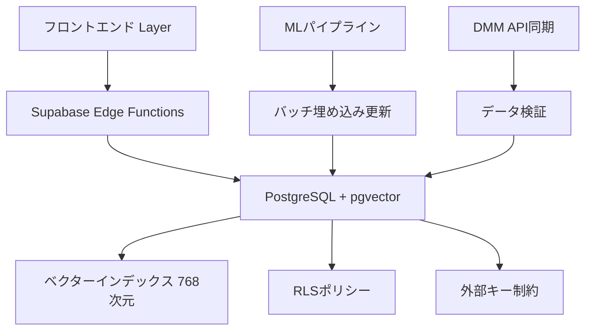

# 設計文書

## 概要

アダルトビデオマッチングアプリケーションのデータベースアーキテクチャは、20万件以上のビデオメタデータ、AI駆動型推薦システム、リアルタイムユーザーインタラクションを支える高性能で安全なPostgreSQLベースのシステムです。pgvector拡張機能を使用した768次元ベクター類似性検索により、Two-Towerモデルのパーソナライズ推薦を実現し、Row Level Security（RLS）による完全なデータプライバシー保護を提供します。

## ステアリング文書との整合性

### 技術標準 (tech.md)
- **PostgreSQL + Supabase**: 技術スタックで定められたメイン技術の使用
- **TypeScript統合**: フロントエンドとの型安全性保証
- **Python MLパイプライン**: 機械学習コンポーネントとの分離された統合
- **Edge Functions**: サーバーレスAPI設計パターンの採用

### プロジェクト構造 (structure.md)  
- **snake_case命名**: データベーステーブルとカラム名の統一
- **マイグレーション管理**: `supabase/migrations/`ディレクトリでのバージョン管理
- **RLS分離**: ユーザーデータの適切な境界設定
- **モジュラー設計**: 各テーブルが単一責任原則に従う構造

## 既存コード再利用分析

### 活用する既存コンポーネント
- **Supabaseクライアント**: `frontend/lib/supabase.ts`のクライアント接続
- **Database型定義**: `frontend/lib/database.types.ts`の型システム統合
- **認証システム**: Supabase Authとの既存統合パターン
- **Edge Functions**: `supabase/functions/`内の既存APIエンドポイント構造

### 統合ポイント
- **既存テーブル**: 現在の`videos`, `user_video_decisions`, `user_embeddings`テーブル構造の活用
- **API接続**: DMM同期スクリプト（`scripts/real_dmm_sync.js`）との互換性維持
- **MLパイプライン**: `ml_pipeline/`ディレクトリでの埋め込みベクトル統合
- **フロントエンド**: React コンポーネントでのリアルタイムデータ表示

## アーキテクチャ

このデータベース設計は、スケーラビリティ、パフォーマンス、セキュリティを重視した3層アーキテクチャを採用しています：

### モジュラー設計原則
- **単一ファイル責任**: 各マイグレーションファイルは特定のスキーマ変更のみ処理
- **コンポーネント分離**: ユーザーデータ、ビデオメタデータ、推薦システムの明確な分離
- **サービス層分離**: データアクセス、ビジネスロジック、プレゼンテーション層の分離
- **ユーティリティモジュラリティ**: 再利用可能なデータベース関数とトリガー



## コンポーネントとインターフェース

### コアデータテーブル（現在実装済み）

#### 1. videos テーブル
- **目的**: ビデオメタデータと検索可能な属性の中央管理
- **インターフェース**: 
  - `INSERT`: API同期時のビデオデータ作成
  - `SELECT`: 推薦システムでの高速検索
  - `UPDATE`: メタデータ更新
- **依存関係**: `tags`, `performers`, `video_embeddings`
- **現在の状態**: ✅ 実装済み（DMM API連携完了）

#### 2. user_embeddings テーブル
- **目的**: ユーザー嗜好ベクトルの管理と類似性検索（768次元）
- **インターフェース**:
  - `UPSERT`: ユーザー行動に基づくベクター更新
  - `SELECT`: 類似性計算での高速ベクター検索
- **依存関係**: `auth.users`, `pgvector`拡張
- **現在の状態**: ✅ 実装済み（768次元ベクター）

#### 3. user_video_decisions テーブル
- **目的**: ユーザー-ビデオ間インタラクション記録（like/nope）
- **インターフェース**:
  - `INSERT`: スワイプ操作での即座のデータ記録
  - `SELECT`: 推薦アルゴリズムでの履歴参照
- **依存関係**: `videos`, `auth.users`, RLSポリシー
- **現在の状態**: ✅ 実装済み（旧likesテーブルから進化）

#### 4. video_embeddings テーブル
- **目的**: ビデオコンテンツベクトルの管理（768次元）
- **インターフェース**:
  - `INSERT/UPDATE`: MLパイプラインからの埋め込み更新
  - `SELECT`: ベクター類似性検索
- **依存関係**: `videos`, `pgvector`拡張
- **現在の状態**: ✅ 実装済み（768次元ベクター）

### セキュリティコンポーネント

#### Row Level Security (RLS)
- **目的**: ユーザーデータの完全分離とプライバシー保護
- **インターフェース**: 自動的なユーザーID検証とデータフィルタリング
- **依存関係**: Supabase認証システム
- **現在の状態**: ✅ 実装済み（主要テーブルで有効）

## データモデル

### ビデオメタデータモデル（現在実装済み）
```sql
-- 既存実装: 包括的なメタデータ構造
CREATE TABLE videos (
  id UUID PRIMARY KEY DEFAULT gen_random_uuid(),
  external_id TEXT UNIQUE,
  title TEXT NOT NULL,
  description TEXT,
  duration_seconds INT,
  thumbnail_url TEXT,
  maker TEXT,
  genre TEXT,
  price NUMERIC,
  source TEXT NOT NULL,
  -- その他多数のフィールド
  UNIQUE (source, distribution_code, maker_code)
);
```

### ユーザー埋め込みモデル（768次元）
```sql
-- 既存実装: 768次元ベクター
CREATE TABLE user_embeddings (
  user_id UUID PRIMARY KEY REFERENCES auth.users(id) ON DELETE CASCADE,
  embedding VECTOR(768) NOT NULL,
  updated_at TIMESTAMPTZ DEFAULT now()
);
```

### インタラクションモデル（進化済み）
```sql
-- 現在実装: user_video_decisions (旧likesから進化)
CREATE TABLE user_video_decisions (
  user_id UUID REFERENCES auth.users(id) ON DELETE CASCADE,
  video_id UUID REFERENCES videos(id) ON DELETE CASCADE,
  decision_type TEXT NOT NULL, -- 'like' or 'nope'
  created_at TIMESTAMPTZ DEFAULT now(),
  PRIMARY KEY (user_id, video_id)
);
```

## エラーハンドリング

### エラーシナリオ

1. **重複データ挿入**:
   - **処理**: UNIQUE制約による自動重複検出
   - **ユーザー影響**: 透明な処理、重複警告ログのみ
   - **現在の状態**: ✅ 実装済み

2. **ベクター次元不一致**:
   - **処理**: 768次元固定での検証
   - **ユーザー影響**: ML埋め込み更新の自動スキップ

3. **認証失敗**:
   - **処理**: RLSによる自動アクセス拒否
   - **ユーザー影響**: 認証画面への自動リダイレクト
   - **現在の状態**: ✅ 実装済み

4. **外部キー制約違反**:
   - **処理**: CASCADE削除による関連データ整合性維持
   - **ユーザー影響**: データ整合性透明保証
   - **現在の状態**: ✅ 実装済み

## テスト戦略

### ユニットテスト
- **RLSポリシー**: 各ポリシーの分離テスト（部分実装済み）
- **データベース関数**: 埋め込み更新・類似性検索機能テスト（要実装）
- **制約検証**: 外部キー・UNIQUE制約の動作確認（基本実装済み）

### 統合テスト
- **認証フロー**: Supabase Authとの完全統合テスト（基本実装済み）
- **MLパイプライン**: バッチ埋め込み更新の一貫性テスト（要実装）
- **API同期**: DMM同期スクリプトとの互換性テスト（実装済み）

### 負荷テスト
- **ベクター検索**: 20万件ビデオでの類似性検索性能（要実装）
- **同時接続**: 100+ユーザーでの同時アクセステスト（要実装）
- **バッチ処理**: 大量データ更新時の性能評価（要実装）