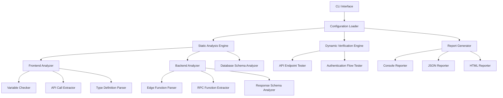

# Design Document

## Overview

Supabase Edge Functions・データベース整合性確認システムは、既存のフロントエンドアプリケーションが使用するSupabase Edge FunctionsとPostgreSQLデータベース間の整合性を検証する。フロントエンドコードは変更せず、バックエンドのAPIレスポンス形式、データベーススキーマ、RPC関数の整合性のみを監視・修正する。

## 現状分析とAPI洗い出し

### フロントエンドで使用されているAPI一覧

**1. videos-feed API**
- **呼び出し箇所**: `frontend/src/app/page.tsx:73`
- **使用方法**: `supabase.functions.invoke('videos-feed', { headers })`
- **期待レスポンス**: `VideoFromApi[]` 配列
- **バックエンド実装**: `supabase/functions/videos-feed/index.ts`
- **状態**: ✅ 実装済み（RPC `get_videos_feed` 使用）

**2. likes API**
- **呼び出し箇所**:
  - GET: `frontend/src/components/LikedVideosDrawer.tsx:83`
  - DELETE: `frontend/src/components/LikedVideosDrawer.tsx:107`
- **使用方法**:
  - GET: `supabase.functions.invoke('likes')`
  - DELETE: `supabase.functions.invoke('likes', { method: 'DELETE', body: { video_id } })`
- **期待レスポンス**: `{ likes: VideoData[] }`
- **バックエンド実装**: `supabase/functions/likes/index.ts`
- **状態**: ✅ 実装済み

**3. update_user_embedding API**
- **呼び出し箇所**: `frontend/src/app/page.tsx:197`
- **使用方法**: `supabase.functions.invoke('update_user_embedding', { body: { batch_phase, batch_size, completed_items } })`
- **期待レスポンス**: エラーチェックのみ
- **バックエンド実装**: `supabase/functions/update_user_embedding/index.ts`
- **状態**: ✅ 実装済み（tags-based対応済み）

**4. delete_account API**
- **呼び出し箇所**: `frontend/src/app/account-management/page.tsx:54`
- **使用方法**: `supabase.functions.invoke('delete_account')`
- **期待レスポンス**: エラーチェックのみ
- **バックエンド実装**: `supabase/functions/delete_account/index.ts`
- **状態**: ✅ 実装済み

### 発見された整合性問題（最新マージ後）

**1. 解決済み問題**
- ✅ `LikedVideosDrawer.tsx`のマージコンフリクトが解決済み
- ✅ 重複したSupabaseクライアント初期化コードが整理済み
- ✅ 基本的な未定義変数問題（`loading`, `error`等）が`LikedVideosDrawer.tsx`で解決済み

**2. 残存する問題**
- `CardData`型定義 - `frontend/src/app/page.tsx`で使用されているが明示的な定義が不明
- バッチ処理関連の古いコード - `handleBatchCompletion`, `currentPhase`, `fetchInitialVideos`, `fetchRecommendationVideos`など使用されていない関数が残存
- API呼び出し先の不整合 - `triggerSwipe`関数が簡略化され、バッチ処理ロジックが削除されている

**3. 型定義の整合性**
- `VideoFromApi` vs `VideoRecord` - 2つの異なるビデオ型定義が併存
- `VideoFromApi` インターフェースでは `performers: { id: string; name: string }[]` だが、バックエンドレスポンスでは `performers: jsonb` 形式

**4. 現在のAPI使用状況**
- **videos-feed API**: ✅ 正常に使用中
- **likes API**: ✅ LikedVideosDrawerで正常に使用中
- **update_user_embedding API**: ⚠️ 使用されていない（古いバッチ処理コード内のみ）
- **delete_account API**: ✅ account-managementページで正常に使用中

### 修正方針

**Phase 1: バックエンド整合性修正（即座に実施）**
1. **Edge Functionsレスポンス形式の標準化**
   - 全APIエンドポイントで統一されたエラーレスポンス形式の実装
   - `videos-feed`, `likes`, `update_user_embedding`, `delete_account`のレスポンス形式統一

2. **データベースRPC関数の整合性確認**
   - `get_videos_feed`関数のパラメータとフロントエンド呼び出しの一致確認
   - `get_user_likes`, `get_user_liked_tags`, `get_user_liked_performers`関数の動作検証

3. **API認証・セキュリティの統一**
   - 全Edge Functionsでの認証ヘッダー処理の統一
   - RLSポリシーとEdge Function認証の整合性確認

**Phase 2: Supabaseバックエンド最適化（中期対応）**
1. **Edge Functions間の共通モジュール化**
   - `_shared/`ディレクトリ内の共通ユーティリティの整理
   - 認証処理、エラーハンドリング、レスポンス形式の共通化

2. **データベーススキーマ最適化**
   - tags-basedシステムの完全移行確認
   - 不要なRPC関数の削除と新機能の追加

**Phase 3: 自動検証・監視システム（長期対応）**
1. **Supabase環境の整合性監視**
   - Edge Functions デプロイメント後の自動テスト
   - データベースマイグレーション後の整合性チェック
   - API エンドポイントの応答時間とエラー率監視

## Steering Document Alignment

### Technical Standards (tech.md)
- **TypeScript First**: 全ての検証ツールをTypeScriptで実装し、型安全性を確保
- **Modular Architecture**: 解析機能を独立したモジュールとして設計
- **Error Handling**: 統一されたエラーハンドリングパターンを適用
- **Testing**: 各モジュールに対応する包括的なテストスイートを実装

### Project Structure (structure.md)
- **Tools Directory**: 検証ツールを`tools/consistency-checker/`に配置
- **Shared Utilities**: 共通ユーティリティを`tools/consistency-checker/utils/`に整理
- **Configuration**: 設定ファイルを`tools/consistency-checker/config/`に配置
- **Reports**: 検証結果レポートを`tools/consistency-checker/reports/`に出力

## Code Reuse Analysis

### Existing Components to Leverage
- **frontend/src/lib/supabase.ts**: Supabaseクライアント設定の解析に活用
- **supabase/functions/_shared/**: 共有ユーティリティとの整合性チェックに利用
- **package.json**: 依存関係解析でフロントエンドライブラリバージョンを確認
- **tsconfig.json**: TypeScript設定の解析で型チェックルールを取得

### Integration Points
- **Supabase Functions**: 既存のEdge Function構造を解析対象として活用
- **Database Migrations**: RPC関数定義を抽出してフロントエンド使用方法と比較
- **Frontend API Calls**: 既存のsupabase.functions.invoke呼び出しパターンを検証
- **Type Definitions**: VideoFromApiなど既存インターフェースの整合性確認

## Architecture

システムは静的解析エンジン、動的検証エンジン、レポート生成エンジンの3層構造で設計される。各エンジンは独立して実行可能で、部分的な検証から全体検証まで柔軟に対応する。

### Modular Design Principles
- **Single File Responsibility**: 各検証タイプ（変数、API、型など）を独立ファイルで処理
- **Component Isolation**: フロントエンド解析とバックエンド解析を分離したコンポーネント
- **Service Layer Separation**: 解析ロジック、データアクセス、レポート生成を分離
- **Utility Modularity**: ファイル読み込み、AST解析、正規表現検索を独立ユーティリティ化



## Components and Interfaces

### Supabase Environment Analyzer
- **Purpose:** Edge Functions、RPC関数、データベーススキーマを解析
- **Interfaces:** `analyzeSupabaseEnvironment(config: SupabaseConfig): SupabaseAnalysisResult`
- **Dependencies:** Deno AST Parser, SQL Parser, Supabase CLI
- **Reuses:** supabase/functions/_shared/共通パターン

### Edge Functions Validator
- **Purpose:** 全Edge Functionsのレスポンス形式とエラーハンドリングを検証
- **Interfaces:** `validateEdgeFunctions(functionsPath: string): ValidationResult`
- **Dependencies:** Deno Runtime, HTTP Client
- **Reuses:** 既存のSupabase認証設定

### Database Schema Checker
- **Purpose:** RPC関数定義とEdge Functions使用の整合性を確認
- **Interfaces:** `checkDatabaseSchema(migrationsPath: string): SchemaResult`
- **Dependencies:** PostgreSQL Client, SQL AST Parser
- **Reuses:** 既存のマイグレーションファイルパターン

### API Response Validator
- **Purpose:** 実際のAPIエンドポイントを呼び出してレスポンス形式を検証
- **Interfaces:** `validateApiResponses(config: APIConfig): ResponseValidationResult`
- **Dependencies:** Supabase Client, HTTP Client
- **Reuses:** 既存のSupabase環境設定

### Authentication Consistency Checker
- **Purpose:** Edge FunctionsとRLSポリシー間の認証整合性を確認
- **Interfaces:** `checkAuthConsistency(authConfig: AuthConfig): AuthResult`
- **Dependencies:** Supabase Auth Client, Database Client
- **Reuses:** 既存のRLSポリシー定義

### Report Generator
- **Purpose:** Supabaseバックエンドの検証結果を出力し、修正提案を生成
- **Interfaces:** `generateSupabaseReport(results: SupabaseValidationResult, format: ReportFormat): string`
- **Dependencies:** Template Engine, File Writer
- **Reuses:** 既存のSupabaseプロジェクト構造

## Data Models

### ProjectConfig
```typescript
interface ProjectConfig {
  frontendPath: string;          // "frontend/src"
  backendPath: string;           // "supabase/functions"
  databasePath: string;          // "supabase/migrations"
  outputPath: string;            // "tools/consistency-checker/reports"
  skipPatterns: string[];        // [".test.", ".spec."]
  includePatterns: string[];     // [".ts", ".tsx", ".sql"]
}
```

### AnalysisResult
```typescript
interface AnalysisResult {
  frontend: FrontendAnalysisResult;
  backend: BackendAnalysisResult;
  consistency: ConsistencyResult;
  errors: AnalysisError[];
  timestamp: Date;
}
```

### VariableIssue
```typescript
interface VariableIssue {
  type: 'undefined' | 'type_mismatch' | 'unused';
  variable: string;
  location: FileLocation;
  expectedType?: string;
  actualType?: string;
  suggestion: string;
}
```

### APIEndpointIssue
```typescript
interface APIEndpointIssue {
  type: 'missing_endpoint' | 'parameter_mismatch' | 'response_mismatch';
  endpoint: string;
  frontendUsage: FileLocation;
  backendDefinition?: FileLocation;
  expectedParams?: Record<string, any>;
  actualParams?: Record<string, any>;
  suggestion: string;
}
```

## Error Handling

### Error Scenarios
1. **ファイル読み込みエラー**
   - **Handling:** ファイルパスの存在確認とアクセス権限チェック
   - **User Impact:** 明確なファイルパス指定の提案メッセージ

2. **AST解析エラー**
   - **Handling:** 構文エラーの詳細位置特定とスキップオプション提供
   - **User Impact:** 構文エラー修正の具体的な指示

3. **API接続エラー**
   - **Handling:** ネットワーク状態確認と再試行メカニズム
   - **User Impact:** 接続設定確認の手順ガイド

4. **型定義不整合**
   - **Handling:** 期待される型と実際の型の詳細比較表示
   - **User Impact:** 型修正の具体的なコード例提供

5. **Supabase認証エラー**
   - **Handling:** 認証情報の有効性確認と更新手順提示
   - **User Impact:** 環境変数設定の確認ガイド

## Testing Strategy

### Unit Testing
- **File Parser Tests**: 各種ファイル形式（.ts, .tsx, .sql）の解析精度テスト
- **Consistency Logic Tests**: 整合性判定ロジックのエッジケース検証
- **Error Handling Tests**: 各種エラーシナリオでの適切な処理確認

### Integration Testing
- **End-to-End Analysis**: 実際のプロジェクト構造での全体解析フロー検証
- **API Verification**: ローカルSupabase環境での動的検証テスト
- **Report Generation**: 複数形式での出力結果の正確性確認

### End-to-End Testing
- **Developer Workflow**: 実際の開発ワークフローでの使用性テスト
- **CI/CD Integration**: 自動化パイプラインでの継続的検証テスト
- **Performance Testing**: 大規模プロジェクトでの解析速度とメモリ使用量測定