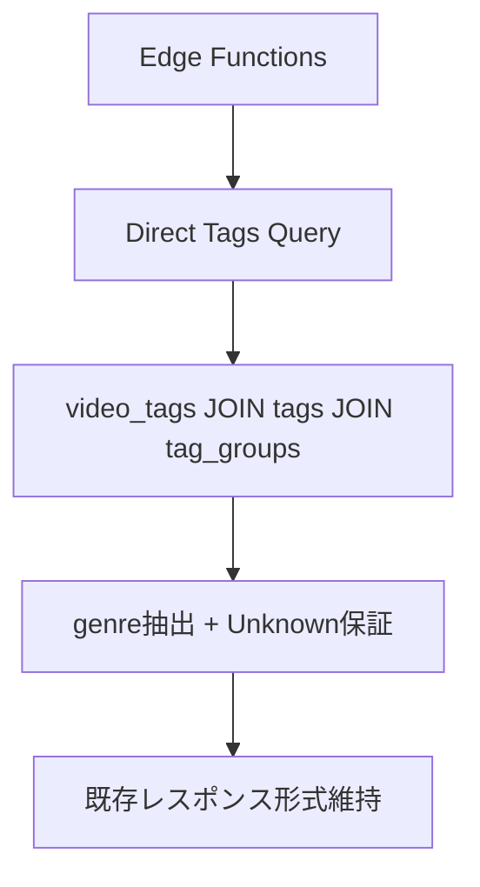

# Design Document

## Overview

このspecは、本番環境と開発環境のスキーマ不整合を解決し、`videos.genre`カラムに依存している既存コードを`tags`システムベースに移行する設計を提供します。

## 現状分析（As-Is）

### スキーマ不整合の実態
- **開発環境**: `videos`テーブルに`genre`カラムが存在
- **本番環境**: `videos`テーブルに`genre`カラムが存在しない
- **結果**: 本番環境でEdge Functionsがエラーで動作停止

### 現在の問題発生箇所（17ファイル）
```
supabase/functions/enhanced_two_tower_recommendations/index.ts:326
  .not('videos.genre', 'is', null);

supabase/functions/content/recommendations/index.ts:260
  if (b.videos.genre) {

supabase/functions/_shared/content.ts:144
  query = query.in('genre', filters.genres);
```

**主要な問題パターン:**
1. **直接参照**: `video.genre`、`videos.genre`の直接使用
2. **フィルタリング**: `.in('genre', filters.genres)`
3. **ユーザー分析**: ジャンル嗜好分析での`videos.genre`使用
4. **レスポンス構築**: APIレスポンスでの`genre: video.genre`

### 既存のタグシステム（利用可能）
```sql
-- 本番・開発共通で存在
tags(id, name, tag_group_id)
video_tags(video_id, tag_id)
tag_groups(id, name)
```

## 目標アーキテクチャ（To-Be）

### 根本的移行: 全クエリをtagsベースに変更

**方針**: アダプター層を使わず、全てのクエリを直接tags/video_tagsテーブルを使用するように根本修正

```sql
-- 現在: videos単体クエリ (本番で失敗)
SELECT id, title, genre, maker FROM videos WHERE id = $1;

-- 新方式: tagsを直接JOIN (本番・開発共通)
SELECT
  v.id,
  v.title,
  v.maker,
  COALESCE(genre_tag.name, 'Unknown') as genre
FROM videos v
LEFT JOIN video_tags vt ON v.id = vt.video_id
LEFT JOIN tags genre_tag ON vt.tag_id = genre_tag.id
LEFT JOIN tag_groups tg ON genre_tag.tag_group_id = tg.id
  AND tg.name ILIKE '%genre%'
WHERE v.id = $1;
```

### データ構造の根本変更

**現在の問題**: videosテーブルのgenreカラムに依存
**新しいアプローチ**: 全てのクエリでtags JOINを標準化

```typescript
// Before: genreカラムに依存
interface Video {
  id: string;
  title: string;
  genre: string;  // ← 本番環境で存在しない
  maker: string;
}

// After: 常にtagsからgenreを取得
interface VideoWithTags {
  id: string;
  title: string;
  maker: string;
  genre: string;  // ← tags JOINから取得
  all_tags: string[];  // ← 追加: 全タグ情報
}
```

## Steering Document Alignment

### Technical Standards (tech.md)

- **PostgreSQL/Supabase**: 既存のtagsテーブル構造を活用
- **Edge Functions**: 既存の関数シグネチャを維持しつつ内部実装のみ変更
- **TypeScript**: 型安全性を保ちながらジャンル取得ロジックを置き換え

### Project Structure (structure.md)

- **Edge Functions**: `supabase/functions/` 内の既存関数を修正
- **共有ライブラリ**: `supabase/functions/_shared/` にジャンル取得ユーティリティを追加
- **データベース**: 既存の `tags`, `video_tags`, `tag_groups` テーブルを活用

## Code Reuse Analysis

### Existing Components to Leverage

- **tags テーブル**: ジャンル情報を含むタグのマスターテーブル
- **video_tags テーブル**: 動画とタグの多対多関係テーブル
- **tag_groups テーブル**: タグのグループ分類（ジャンル判定に使用）
- **既存のSupabaseクライアント**: Edge Functions内で使用中の`createClient()`

### Integration Points

- **Edge Functions**: `enhanced_two_tower_recommendations`, `content`, `feed_explore` 等の12個の関数
- **データベーススキーマ**: 本番環境の既存テーブル構造を維持
- **RPC関数**: `get_videos_feed`, `get_personalized_videos_feed` 等の既存関数

## Architecture

**根本的修正方針**: 中間層なしで、全クエリを直接tags JOINベースに書き換える



### Direct Query Principles

- **No Intermediate Layer**: アダプター層を排除し、直接SQLレベルで修正
- **Uniform Query Pattern**: 全ファイルで統一されたtags JOINパターンを採用
- **Fail-Safe Design**: tags JOINが失敗した場合の`Unknown`ジャンル保証
- **Performance Optimization**: 不要な関数呼び出しオーバーヘッドを排除

## 実装手順（How）

### Phase 1: クエリ構造の根本変更

**方針**: 全てのvideosクエリにtags JOINを標準化し、genreカラム参照を完全に除去

#### 標準クエリパターンの確立
```sql
-- 新しい標準: videos + tags JOIN
SELECT
  v.id, v.title, v.maker, v.price,
  COALESCE(
    (SELECT t.name
     FROM video_tags vt
     JOIN tags t ON vt.tag_id = t.id
     JOIN tag_groups tg ON t.tag_group_id = tg.id
     WHERE vt.video_id = v.id AND tg.name ILIKE '%genre%'
     LIMIT 1),
    'Unknown'
  ) as genre,
  COALESCE(
    (SELECT jsonb_agg(t.name)
     FROM video_tags vt
     JOIN tags t ON vt.tag_id = t.id
     WHERE vt.video_id = v.id),
    '[]'::jsonb
  ) as all_tags
FROM videos v;
```

### Phase 2: 完全書き換え（17ファイル）

**全ファイル共通作業**:
1. `videos`テーブルのSELECTクエリから`genre`カラムを削除
2. 上記の標準クエリパターンに置換
3. TypeScript型定義を`VideoWithTags`に変更
4. エラーハンドリングで`Unknown`ジャンルを保証

#### Group A: 推薦システム根本再構築 (3ファイル)
1. `enhanced_two_tower_recommendations/index.ts`
2. `content/recommendations/index.ts`
3. `two_tower_recommendations/index.ts`

**重要**: エンベディング生成ロジックも全面的に見直し

#### Group B: フィード・検索システム (6ファイル)
4. `content/feed/index.ts`
5. `content/videos-feed/index.ts`
6. `feed_explore/index.ts`
7. `content/search/index.ts`
8. `likes/index.ts`
9. `user-management/likes/index.ts`

#### Group C: ユーティリティ・管理系 (8ファイル)
10. `_shared/content.ts`
11. `_shared/feature_preprocessor.ts`
12. `update_embeddings/index.ts`
13. `update_user_embedding/index.ts`
14. `user-management/embeddings/index.ts`
15. `user-management/_shared/database.ts`
16. `user-management/profile/index.ts`
17. `recommendations/enhanced_two_tower/index.ts`

### Phase 3: エンベディングシステム再学習

**現在のgenreベースエンベディング**: 完全に無効化
**新しいtagsベースエンベディング**: 全て再生成

#### 再学習が必要な要素
1. **ユーザーエンベディング**: ジャンル嗜好の算出方法変更
2. **ビデオエンベディング**: タグベースの特徴量抽出
3. **推薦モデル**: genre_encodedをtags_encodedに変更
4. **類似度計算**: ジャンル類似度からタグ類似度へ

## Components and Interfaces

### 修正対象: 17個のEdge Functions

**共通修正パターン**:
1. **クエリ修正**: `videos`テーブルのSELECTからgenreカラムを削除
2. **JOIN追加**: tags/video_tags/tag_groupsのJOINを追加
3. **型変更**: `Video`を`VideoWithTags`に変更
4. **エラーハンドリング**: tags JOINが失敗した場合の`Unknown`ジャンル保証

### TypeScript型定義の根本変更

```typescript
// 削除: 旧Video型
interface Video {
  id: string;
  title: string;
  genre: string;  // ← 削除
}

// 新規: VideoWithTags型
interface VideoWithTags {
  id: string;
  title: string;
  maker: string;
  price: number;
  genre: string;        // tags JOINから取得
  all_tags: string[];   // 全タグ情報
}
```

### クエリ修正の具体例

#### パターン1: 基本SELECTクエリ
```typescript
// Before (失敗)
const { data } = await supabaseClient
  .from('videos')
  .select('id, title, genre, maker')
  .eq('id', videoId);

// After (成功)
const { data } = await supabaseClient
  .from('videos')
  .select(`
    id, title, maker, price,
    genre:video_tags!inner(
      tags!inner(
        name,
        tag_groups!inner(name)
      )
    )
  `)
  .eq('id', videoId);
```

#### パターン2: ジャンルフィルタリング
```typescript
// Before (失敗)
.in('genre', filters.genres)

// After (成功)
.in('video_tags.tags.name', filters.genres)
```

### 影響を受ける主要機能

1. **推薦システム**: ジャンル類似度計算の完全再実装
2. **ユーザー嗜好分析**: tags JOINベースの嗜好算出
3. **フィード生成**: ジャンル多様性計算の修正
4. **検索機能**: ジャンル検索クエリの書き換え

## Data Models

### 既存のタグ関連テーブル構造

```sql
-- tags テーブル（既存）
tags {
  id: uuid (PK)
  name: text
  tag_group_id: uuid (FK)
}

-- video_tags テーブル（既存）
video_tags {
  video_id: uuid (PK, FK)
  tag_id: uuid (PK, FK)
}

-- tag_groups テーブル（既存）
tag_groups {
  id: uuid (PK)
  name: text
}
```

### ジャンル取得クエリパターン

```sql
-- 動画のジャンル取得
SELECT t.name
FROM tags t
JOIN video_tags vt ON t.id = vt.tag_id
JOIN tag_groups tg ON t.tag_group_id = tg.id
WHERE vt.video_id = $1
  AND tg.name ILIKE '%genre%'
ORDER BY t.name
LIMIT 1;
```

## Error Handling

### Error Scenarios

1. **タグデータが存在しない場合:**
   - **Handling:** デフォルトジャンル "Unknown" を返却
   - **User Impact:** 既存システムと同じ動作を維持

2. **データベース接続エラー:**
   - **Handling:** エラーログ出力後、フォールバック値を返却
   - **User Impact:** システム継続動作、エラーページは表示されない

3. **複数ジャンル存在時:**
   - **Handling:** アルファベット順で最初のジャンルを主ジャンルとして返却
   - **User Impact:** 一貫性のあるジャンル表示

## Testing Strategy

### Unit Testing

- genre-adapter.tsの各関数の単体テスト
- モックデータベースを使用したテスト環境構築
- エラーケースのフォールバック動作テスト

### Integration Testing

- 既存Edge Functionsの動作確認
- タグデータとの結合テスト
- API レスポンス形式の互換性確認

### End-to-End Testing

- フロントエンドからの既存API呼び出しテスト
- 推薦システム全体での動作確認
- 本番環境での動作テスト