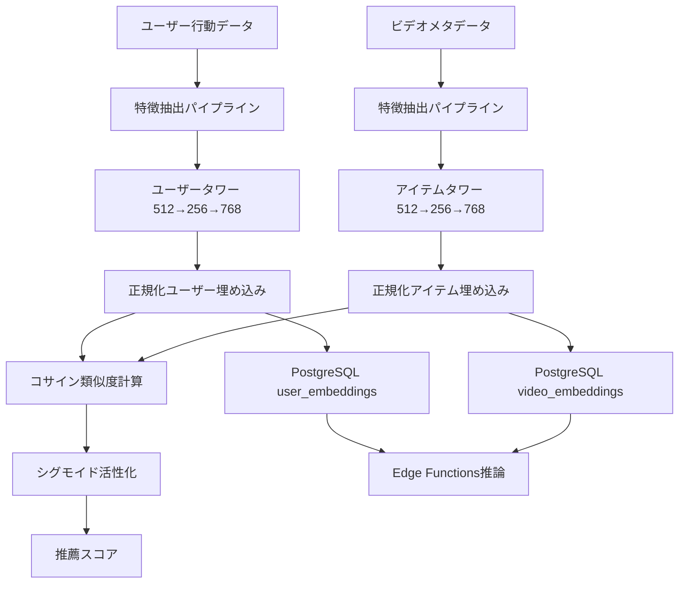

# 設計文書

## 概要

Two-Towerモデルは、アダルトビデオマッチングアプリケーションの推薦精度を根幹から支える深層学習アーキテクチャです。ユーザータワーとアイテムタワーの独立した768次元埋め込み生成により、高速で拡張性の高いパーソナライズ推薦を実現します。現在実装されている評価ベース疑似ユーザーデータ（50ユーザー、32,304アイテム、99.7% AUC-PR）からリアルユーザーインタラクションベースの推薦システムへの進化を設計します。

## ステアリング文書との整合性

### 技術標準 (tech.md)
- **TensorFlow 2.16+**: 主要な深層学習フレームワークとしてのTensorFlow採用
- **Python MLパイプライン**: 既存のml_pipeline/構造との統合
- **PostgreSQL + pgvector**: 768次元ベクター埋め込みの高速検索
- **Supabase Edge Functions**: TensorFlow.js/ONNX形式での本番推論

### プロジェクト構造 (structure.md)  
- **ml_pipeline/training/**: 訓練スクリプトとモデル管理の中央集約
- **ml_pipeline/models/**: 訓練済みモデルとメタデータの版管理
- **supabase/functions/**: Edge Functions経由の推論API提供
- **明確な境界**: データ前処理、訓練、推論の段階的分離

## 既存コード再利用分析

### 活用する既存コンポーネント
- **RatingBasedTwoTowerTrainer**: 現在実装の疑似ユーザーベース訓練システム
- **TwoTowerTrainer**: PostgreSQL直接連携の基本訓練フレームワーク
- **Edge Functions構造**: two_tower_recommendations/index.ts の推論パターン
- **特徴処理**: TF-IDF、カテゴリエンコーダ、StandardScalerの既存実装

### 統合ポイント
- **データベーステーブル**: user_video_decisionsの新しいインタラクション形式への対応
- **埋め込み管理**: user_embeddings, video_embeddingsテーブルとの双方向同期
- **バッチ処理**: 既存のbatch_embedding_update.pyとの連携
- **API統合**: 既存の推薦Edge Functionsとの互換性維持

## アーキテクチャ

Two-Towerアーキテクチャは、学習とサービングの効率性を両立する設計思想に基づいています：

### モジュラー設計原則
- **タワー独立性**: ユーザー・アイテムタワーの完全な独立訓練・推論
- **特徴処理分離**: 前処理パイプラインの再利用可能なモジュール化
- **モデル版管理**: 訓練済みモデルの段階的デプロイとA/Bテスト対応
- **埋め込み管理**: ベクターデータベースとの効率的な同期



## コンポーネントとインターフェース

### 1. 特徴抽出パイプライン

#### ユーザー特徴処理器
- **目的**: user_video_decisionsから行動パターンを数値ベクターに変換
- **インターフェース**:
  - `extract_user_features(user_id: str) -> np.ndarray`
  - `batch_user_features(user_ids: List[str]) -> np.ndarray`
- **依存関係**: user_video_decisions、videos（ジャンル・価格情報）
- **再利用**: 既存のgenre_encoder、StandardScalerパターン

#### アイテム特徴処理器
- **目的**: ビデオメタデータを多次元特徴ベクターに変換
- **インターフェース**:
  - `extract_video_features(video_id: str) -> np.ndarray`
  - `batch_video_features(video_ids: List[str]) -> np.ndarray`
- **依存関係**: videos、performers、tags
- **再利用**: 既存のTF-IDFVectorizer、カテゴリエンコーダ

### 2. Two-Towerニューラルネットワーク

#### ユーザータワー
- **目的**: ユーザー特徴を768次元正規化埋め込みに変換
- **アーキテクチャ**: 入力 → Dense(512, ReLU) → Dropout(0.3) → Dense(256, ReLU) → Dropout(0.3) → Dense(768, tanh) → L2正規化
- **出力**: 768次元正規化ベクター（||embedding|| = 1）
- **活性化**: tanh（最終層）でベクター値の安定化

#### アイテムタワー
- **目的**: ビデオ特徴を768次元正規化埋め込みに変換
- **アーキテクチャ**: 入力 → Dense(512, ReLU) → Dropout(0.3) → Dense(256, ReLU) → Dropout(0.3) → Dense(768, tanh) → L2正規化
- **出力**: 768次元正規化ベクター（||embedding|| = 1）
- **対称性**: ユーザータワーと同一構造でコサイン類似度計算を保証

### 3. 訓練システム

#### 訓練データ生成器
- **目的**: 正例・負例ペアの効率的な生成とバランシング
- **インターフェース**:
  - `create_training_pairs() -> Tuple[user_indices, item_indices, labels]`
  - `negative_sampling(user_id: str, ratio: int = 2) -> List[item_ids]`
- **戦略**: 時系列考慮の正例1:負例2バランシング
- **再利用**: 既存のcreate_training_pairsパターンを拡張

#### モデル訓練器
- **目的**: Two-Towerモデルの安定した高精度訓練
- **インターフェース**:
  - `train_model(epochs: int = 50) -> TrainingHistory`
  - `evaluate_model() -> Dict[str, float]`
- **最適化**: Adam optimizer、Early Stopping、ReduceLROnPlateau
- **再利用**: 既存のコールバック・評価パターン

### 4. 埋め込み管理システム

#### 埋め込み生成器
- **目的**: 訓練済みタワーからの高速埋め込み生成
- **インターフェース**:
  - `generate_user_embeddings(user_ids: List[str]) -> np.ndarray`
  - `generate_video_embeddings(video_ids: List[str]) -> np.ndarray`
- **バッチサイズ**: メモリ効率を考慮した適応的バッチ処理
- **再利用**: 既存のbatch_embedding_update.pyとの統合

#### データベース同期器
- **目的**: PostgreSQLとの双方向埋め込み同期
- **インターフェース**:
  - `sync_embeddings_to_db() -> int`  # 更新レコード数
  - `load_embeddings_from_db() -> Dict[str, np.ndarray]`
- **トランザクション**: UPSERT操作での一貫性保証
- **再利用**: 既存のPostgreSQL接続パターン

### 5. 推論API

#### リアルタイム推薦器
- **目的**: Edge Functions経由の高速推薦配信
- **インターフェース**:
  - `recommend_videos(user_id: str, limit: int = 20) -> List[RecommendedVideo]`
  - `calculate_similarity(user_embedding: np.ndarray, video_embeddings: np.ndarray) -> np.ndarray`
- **レスポンス時間**: 500ms未満の推薦生成
- **再利用**: 既存のtwo_tower_recommendations Edge Function拡張

## データモデル

### 訓練データ構造
```python
# ユーザー特徴ベクター (既存から拡張)
user_features = {
    'behavioral': [total_likes, avg_price, likes_per_day],  # 3次元
    'genre_preferences': [genre_0, genre_1, ..., genre_n],  # ジャンル数次元
    'temporal': [days_active, recency_score],  # 2次元
    'cold_start_default': [0.0] * feature_dim  # 新規ユーザー対応
}

# アイテム特徴ベクター (既存TF-IDF拡張)
video_features = {
    'text_features': tfidf_vector,  # TF-IDF 1000次元
    'categorical': [genre_encoded, maker_encoded],  # カテゴリ 2次元
    'numerical': [price_normalized, duration_normalized],  # 数値 2次元
    'metadata': [performer_count, tag_count]  # メタデータ 2次元
}
```

### 埋め込みストレージモデル
```sql
-- 既存テーブルとの互換性維持
user_embeddings: {
  user_id: UUID PRIMARY KEY,
  embedding: VECTOR(768),  -- 現在実装の768次元維持
  updated_at: TIMESTAMP,
  model_version: VARCHAR(50)  -- A/Bテスト対応
}

video_embeddings: {
  video_id: UUID PRIMARY KEY,
  embedding: VECTOR(768),  -- 現在実装の768次元維持
  updated_at: TIMESTAMP,
  model_version: VARCHAR(50)  -- A/Bテスト対応
}
```

## エラーハンドリング

### エラーシナリオ

1. **コールドスタート問題**:
   - **処理**: 新規ユーザー・ビデオのデフォルト特徴量生成
   - **ユーザー影響**: 初期推薦品質の段階的向上
   - **対策**: 人気ベースフォールバックとランダム探索のバランシング

2. **特徴抽出失敗**:
   - **処理**: 欠損値補完とデフォルト値設定
   - **ユーザー影響**: 推薦継続（品質は若干低下）
   - **対策**: 堅牢な前処理パイプラインと異常値検出

3. **モデル推論エラー**:
   - **処理**: フォールバック推薦（人気ベース）への自動切り替え
   - **ユーザー影響**: 推薦サービス継続
   - **対策**: ヘルスチェックと自動復旧メカニズム

4. **埋め込み同期失敗**:
   - **処理**: 再試行とバックアップ埋め込みの使用
   - **ユーザー影響**: 推薦精度の一時的低下
   - **対策**: 段階的更新とロールバック機能

## テスト戦略

### ユニットテスト
- **特徴処理**: 各種エンコーダとスケーラーの出力検証
- **モデル構造**: タワー出力の次元・正規化検証
- **埋め込み生成**: ベクター品質と一貫性のテスト

### 統合テスト
- **E2Eパイプライン**: 生データ→特徴→訓練→埋め込み→推薦の全体フロー
- **データベース連携**: PostgreSQLとの双方向同期の正確性
- **API統合**: Edge Functionsとの完全なインターフェーステスト

### パフォーマンステスト
- **訓練速度**: 5万インタラクションでの1時間未満訓練達成
- **推論速度**: 単一推薦500ms未満、バッチ推薦効率性
- **メモリ使用量**: 訓練8GB未満、推論2GB未満の制約遵守

### A/Bテスト
- **推薦品質**: 現在の評価ベースモデル（AUC-PR 99.7%）との比較
- **ユーザーエンゲージメント**: クリック率・滞在時間の向上測定
- **収束速度**: 新規ユーザーの推薦品質改善速度評価