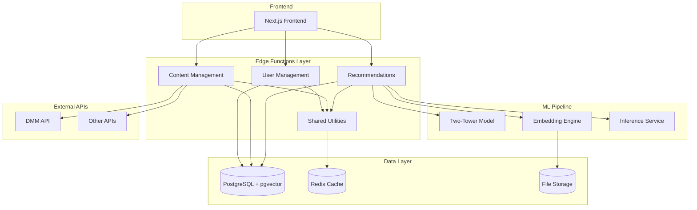

# Backend Architecture Overview

## 🏗️ アーキテクチャ概要

Adult Matching Applicationのバックエンドは、マイクロサービス的なアプローチを採用し、機能別に分離された構造になっています。

## 📊 システム構成図



## 🎯 設計原則

### 1. **関心の分離 (Separation of Concerns)**
- ユーザー管理、コンテンツ管理、推薦機能を独立したモジュールに分離
- 各モジュールは特定の責任のみを持つ

### 2. **共通ユーティリティの活用**
- 認証、データベース操作、エラーハンドリングなどの共通機能を統合
- コード重複の削減と保守性の向上

### 3. **型安全性の確保**
- TypeScriptによる厳密な型定義
- 実行時エラーの削減とIDEサポートの向上

### 4. **パフォーマンス最適化**
- pgvectorによる高速ベクトル検索
- 適切なキャッシング戦略
- データベースクエリの最適化

### 5. **スケーラビリティ**
- Edge Functionsによる自動スケーリング
- 負荷分散とホリゾンタルスケーリング対応

## 📋 主要コンポーネント

### Edge Functions Layer

#### User Management (`/user-management`)
- **認証・認可**: JWT based authentication
- **ユーザープロファイル管理**: 設定、嗜好データ
- **いいね機能**: 動画への評価機能
- **エンベディング更新**: ユーザー嗜好ベクトル更新
- **アカウント管理**: 削除、データクリーンアップ

#### Content Management (`/content`)
- **フィード生成**: 多様性重視の探索フィード
- **検索機能**: テキスト・フィルタ検索
- **コンテンツ配信**: 動画メタデータ配信
- **キュレーション**: 編集部によるコンテンツ選択

#### Recommendations (`/recommendations`)
- **パーソナライズ推薦**: Two-Towerモデルベース
- **類似度計算**: ベクトル空間での類似度
- **多様性制御**: ジャンル・メーカー分散
- **説明可能性**: 推薦理由の提供

#### Shared Utilities (`/_shared`)
- **共通型定義**: TypeScript interfaces
- **認証ユーティリティ**: 認証状態管理
- **データベースヘルパー**: クエリ最適化
- **エラーハンドリング**: 統一エラー処理

### ML Pipeline

#### Training Module
- **データ前処理**: 特徴量エンジニアリング
- **モデル訓練**: Two-Tower架構の学習
- **評価・検証**: 精度・多様性指標
- **モデル最適化**: ハイパーパラメータ調整

#### Inference Engine
- **リアルタイム推論**: 低レイテンシ推薦
- **バッチ推論**: 大量データ処理
- **ベクトル検索**: pgvector連携
- **結果後処理**: 多様性フィルタリング

#### Model Management
- **バージョニング**: モデルのバージョン管理
- **A/Bテスト**: 複数モデルの比較実験
- **パフォーマンス監視**: 精度劣化検知
- **自動再訓練**: データ更新時の再学習

### Data Processing Pipeline

#### Web Scraping
- **レビューデータ収集**: 既存プラットフォームからの収集
- **レート制限**: API制限への対応
- **データ品質管理**: 収集データの検証

#### Data Cleaning
- **重複除去**: 類似コンテンツの統合
- **データ正規化**: フォーマット統一
- **品質フィルタリング**: 低品質データの除外

#### Embedding Generation
- **テキストエンベディング**: 説明文のベクトル化
- **画像エンベディング**: サムネイルの特徴抽出
- **結合エンベディング**: マルチモーダル表現

## 🔄 データフロー

### 1. **ユーザーアクション処理**
```
User Action → Edge Function → Database → Response
```

### 2. **推薦生成フロー**
```
User Request → Authentication → User Embedding Retrieval → 
Similarity Search → Diversity Filtering → Response
```

### 3. **データ更新フロー**
```
External API → Data Processing → Database Update → 
Embedding Update → Model Retraining (if needed)
```

## 🛡️ セキュリティ

### 認証・認可
- **JWT認証**: ステートレス認証
- **Row Level Security**: データベースレベルの権限制御
- **Rate Limiting**: API濫用防止
- **CORS設定**: オリジン制限

### データ保護
- **暗号化**: 機密データの暗号化
- **監査ログ**: アクセス履歴の記録
- **データ保持**: GDPR準拠のデータ管理
- **アクセス制御**: 最小権限の原則

## 📈 パフォーマンス最適化

### データベース最適化
- **インデックス設計**: 適切なインデックス配置
- **クエリ最適化**: N+1問題の回避
- **コネクションプーリング**: DB接続の効率化
- **pgvector調整**: ベクトル検索の高速化

### キャッシング戦略
- **ユーザーエンベディング**: 30分TTL
- **推薦結果**: 1時間TTL
- **検索結果**: 15分TTL
- **静的コンテンツ**: CDNによる配信

### 非同期処理
- **バッチ処理**: 重い処理の非同期実行
- **キューシステム**: タスクの順次処理
- **Webhooks**: イベント駆動アーキテクチャ

## 🔍 監視・ログ

### パフォーマンス監視
- **レスポンス時間**: API応答時間の追跡
- **スループット**: リクエスト処理量
- **エラー率**: 障害発生頻度
- **リソース使用量**: CPU・メモリ監視

### ビジネス指標
- **推薦精度**: クリック率・コンバージョン率
- **ユーザーエンゲージメント**: アクティブユーザー数
- **コンテンツ多様性**: ジャンル分散度
- **システム健全性**: 可用性指標

### ログ管理
- **構造化ログ**: JSON形式でのログ出力
- **ログレベル**: DEBUG/INFO/WARN/ERROR
- **ログローテーション**: ディスク容量管理
- **中央ログ管理**: ログ集約・検索

## 🚀 デプロイメント

### 環境管理
- **Development**: 開発・テスト環境
- **Staging**: 本番前検証環境
- **Production**: 本番環境

### CI/CD パイプライン
- **自動テスト**: ユニット・統合テスト
- **品質チェック**: コード品質・セキュリティ
- **段階的デプロイ**: Blue-Green deployment
- **ロールバック**: 障害時の迅速復旧

### インフラ管理
- **Supabase**: マネージドサービス活用
- **Auto Scaling**: 負荷に応じた自動スケール
- **Health Checks**: ヘルスチェック監視
- **Disaster Recovery**: 災害復旧計画

---

最終更新: 2025年1月13日